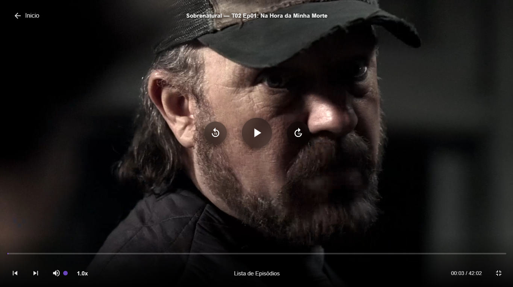
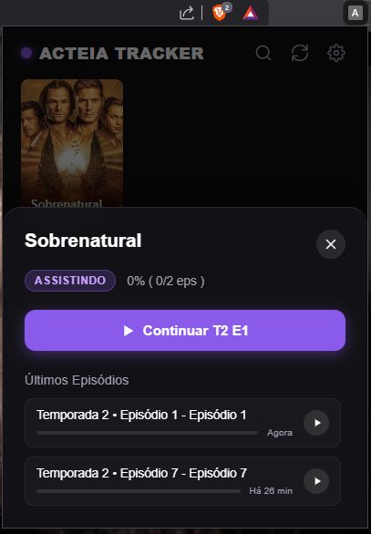

# Acteia Tracker V2 🚀

O **Acteia Tracker V2** é a evolução definitiva para quem assiste no Acteia no Pc. Ele renova o player, rastreia seus episódios automaticamente e limpa todos os erros do console.

---

## 📸 Demonstração

### Player Moderno com Títulos
O player agora mostra o nome do filme ou série no topo e possui botões renovados.

### Histórico Inteligente na Home
Veja onde você parou diretamente na página inicial.

---

## ✨ Principais Funções

- **Rastreio Automático**: Salva seu progresso a cada 10 segundos. Nunca mais perca o minuto exato onde parou.
- **Botão Continuar**: Atalho que aparece no player para você retomar o vídeo com um clique.

---

## 🛠️ Instalação Rápida (30 segundos)

1. **Baixe o arquivo [tracker_v2.zip](tracker_v2.zip)** e extraia a pasta no seu PC.
2. No Chrome, abra o endereço: `chrome://extensions`
3. Ative o **Modo do Desenvolvedor** (chave no topo direito).
4. **Arraste a pasta `tracker`** que você extraiu direto para dentro da página de extensões do Chrome.

---

*Gostou do projeto? Deixe uma ⭐ no GitHub!*
